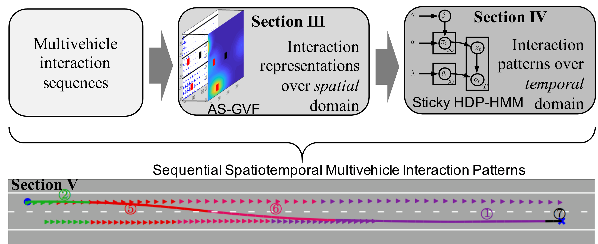
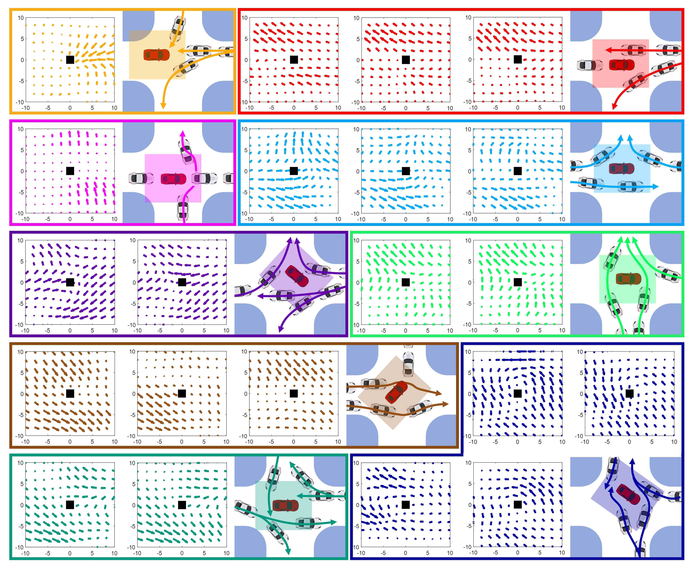

## Spatiotemporal Learning of Multivehicle Interaction Patterns in Lane-Change Scenarios
#### **[Chengyuan Zhang](https://chengyuanzhang.wixsite.com/home), [Jiacheng Zhu](https://www.linkedin.com/in/jiacheng-zhu-56273886/), [Wenshuo Wang](http://wenshuow.com/), and [Junqiang Xi](http://me-english.bit.edu.cn/people/facultydept/vehiclee2/xs3/126028.htm)**

  

  
<b>[Abstract]</b>

  
  Interpretation of common-yet-challenging interaction scenarios can benefit well-founded decisions for autonomous vehicles. Previous research achieved this using their prior knowledge of specific scenarios with predefined models, limiting their adaptive capabilities. This paper describes a Bayesian nonparametric approach that leverages continuous (i.e., Gaussian processes) and discrete (i.e., Dirichlet processes) stochastic processes to reveal underlying interaction patterns of the ego vehicle with other nearby vehicles. Our model relaxes dependency on the number of surrounding vehicles by developing an acceleration-sensitive velocity field based on Gaussian processes. The experiment results demonstrate that the velocity field can represent the _spatial_ interactions between the ego vehicle and its surroundings. Then, a discrete Bayesian nonparametric model, integrating Dirichlet processes and hidden Markov models, is developed to learn the interaction patterns over the _temporal_ space by segmenting and clustering the sequential interaction data into interpretable granular patterns automatically. We then evaluate our approach in the highway lane-change scenarios using the highD dataset collected from real-world settings. Results demonstrate that our proposed Bayesian nonparametric approach provides an insight into the complicated lane-change interactions of the ego vehicle with multiple surrounding traffic participants based on the interpretable interaction patterns and their transition properties in temporal relationships. Our proposed approach sheds light on efficiently analyzing other kinds of multi-agent interactions, such as vehicle-pedestrian interactions.

  
<b>[Bibtex]</b>

    <pre>@article{zhang2020spatiotemporal,  
      title={Spatiotemporal learning of multivehicle interaction patterns in lane-change scenarios},  
      author={Zhang, Chengyuan and Zhu, Jiacheng and Wang, Wenshuo and Xi, Junqiang},  
      journal={arXiv preprint arXiv:2003.00759},  
      year={2020}  
      }</pre>

- **Access our paper via: [[arXiv](https://arxiv.org/pdf/2003.00759v2.pdf)].**
- **Watch the demos via: [[YouTube](https://youtu.be/-SkjnxmMVgA)] or [[Bilibili](https://www.bilibili.com/video/BV1BD4y1m7VL/)].**
- **Also check the supplements via: [[Spatiotemporal_Appendix.pdf](./files/Spatiotemporal_Appendix.pdf)].**

   
- - -  
## A General Framework of Learning Multi-Vehicle Interaction Patterns from Videos
#### **[Chengyuan Zhang](https://chengyuanzhang.wixsite.com/home), [Jiacheng Zhu](https://www.linkedin.com/in/jiacheng-zhu-56273886/), [Wenshuo Wang](http://wenshuow.com/), and [Ding Zhao](https://safeai-lab.github.io/)**

  

  
<b>[Abstract]</b>

  
  Semantic learning and understanding of multi-vehicle interaction patterns in a cluttered driving environment are essential but challenging for autonomous vehicles to make proper decisions. This paper presents a general framework to gain insights into intricate multi-vehicle interaction patterns from bird's-eye view traffic videos. We adopt a Gaussian velocity field to describe the time-varying multi-vehicle interaction behaviors and then use deep autoencoders to learn associated latent representations for each temporal frame. Then, we utilize a hidden semi-Markov model with a hierarchical Dirichlet process as a prior to segment these sequential representations into granular components, also called traffic primitives, corresponding to interaction patterns. Experimental results demonstrate that our proposed framework can extract traffic primitives from videos, thus providing a semantic way to analyze multi-vehicle interaction patterns, even for cluttered driving scenarios that are far messier than human beings can cope with.

  
<b>[Bibtex]</b>

    <pre>@article{@inproceedings{zhang2019general,  
      title={A General Framework of Learning Multi-Vehicle Interaction Patterns from Video},  
      author={Zhang, Chengyuan and Zhu, Jiacheng and Wang, Wenshuo and Zhao, Ding},  
      booktitle={2019 IEEE Intelligent Transportation Systems Conference (ITSC)},  
      pages={4323--4328},  
      year={2019},  
      organization={IEEE}  
    }</pre>

- **Access our paper via: [[IEEE ITSC19](https://ieeexplore.ieee.org/abstract/document/8917212)] or [[arXiv](https://arxiv.org/pdf/1907.07315)].**

 
**If you have any questions please feel free to contact us:  Chengyuan Zhang (<enzozcy@gmail.com>), Wenshuo Wang (<wwsbit@gmail.com>)**
