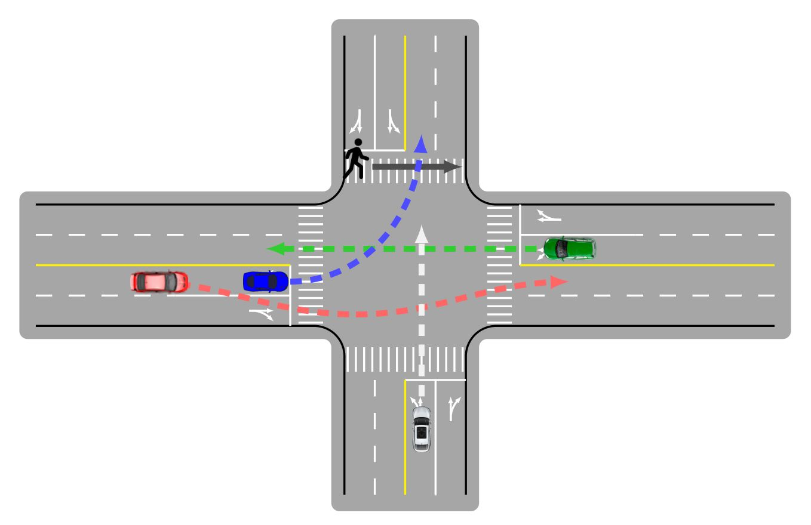
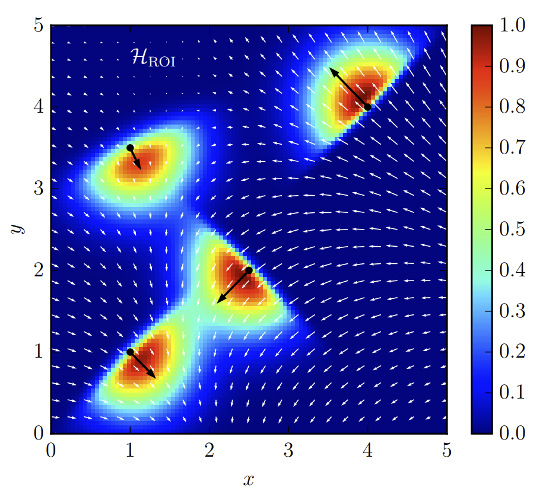

- - -  
## Social Interactions for Autonomous Driving: A Review and Perspective
#### **[Wenshuo Wang](http://wenshuow.com/), [Letian Wang](https://letianwang0.wixsite.com/myhome), [Chengyuan Zhang](https://chengyuanzhang.wixsite.com/home), [Changliu Liu](http://www.cs.cmu.edu/~cliu6/) and [Lijun Sun](https://lijunsun.github.io/)**

  

  
<b><mark>[Abstract]</mark></b>

  
  No human drives a car in a vacuum; she/he must negotiate with other road users to achieve their goals in social traffic scenes. A rational human driver can interact with other road users in a socially-compatible way through implicit communications to complete their driving tasks smoothly in interaction-intensive, safety-critical environments. This paper aims to review the existing approaches and theories to help understand and rethink the interactions among human drivers toward social autonomous driving. We take this survey to seek the answers to a series of fundamental questions: 1) What is social interaction in road traffic scenes? 2) How to measure and evaluate social interaction? 3) How to model and reveal the process of social interaction? 4) How do human drivers reach an implicit agreement and negotiate smoothly in social interaction? This paper reviews various approaches to modeling and learning the social interactions between human drivers, ranging from optimization theory, deep learning, and graphical models to social force theory and behavioral & cognitive science. We also highlight some new directions, critical challenges, and opening questions for future research.

  
<b><mark>[Bibtex]</mark> </b>

    <pre>@article{wang2022social,
      title={Social Interactions for Autonomous Driving: A Review and Perspective},
      author={Wang, Wenshuo and Wang, Letian and Zhang, Chengyuan and Liu, Changliu and Sun, Lijun},
      journal={arXiv preprint arXiv:2208.07541},
      year={2022}
    }</pre>

- **Access our paper via: [[arXiv](https://arxiv.org/abs/2208.07541)].**

   

- - -  
## Spatiotemporal Learning of Multivehicle Interaction Patterns in Lane-Change Scenarios
#### **[Chengyuan Zhang](https://chengyuanzhang.wixsite.com/home), [Jiacheng Zhu](https://jiachengzhuml.github.io/), [Wenshuo Wang](http://wenshuow.com/), and Junqiang Xi**

  

  
<b><mark>[Abstract]</mark></b>

  
  Interpretation of common-yet-challenging interaction scenarios can benefit well-founded decisions for autonomous vehicles. Previous research achieved this using their prior knowledge of specific scenarios with predefined models, limiting their adaptive capabilities. This paper describes a Bayesian nonparametric approach that leverages continuous (i.e., Gaussian processes) and discrete (i.e., Dirichlet processes) stochastic processes to reveal underlying interaction patterns of the ego vehicle with other nearby vehicles. Our model relaxes dependency on the number of surrounding vehicles by developing an acceleration-sensitive velocity field based on Gaussian processes. The experiment results demonstrate that the velocity field can represent the _spatial_ interactions between the ego vehicle and its surroundings. Then, a discrete Bayesian nonparametric model, integrating Dirichlet processes and hidden Markov models, is developed to learn the interaction patterns over the _temporal_ space by segmenting and clustering the sequential interaction data into interpretable granular patterns automatically. We then evaluate our approach in the highway lane-change scenarios using the highD dataset collected from real-world settings. Results demonstrate that our proposed Bayesian nonparametric approach provides an insight into the complicated lane-change interactions of the ego vehicle with multiple surrounding traffic participants based on the interpretable interaction patterns and their transition properties in temporal relationships. Our proposed approach sheds light on efficiently analyzing other kinds of multi-agent interactions, such as vehicle-pedestrian interactions.

  
<b><mark>[Bibtex]</mark> </b>

    <pre>@article{zhang2021spatiotemporal,
      title={Spatiotemporal learning of multivehicle interaction patterns in lane-change scenarios},
      author={Zhang, Chengyuan and Zhu, Jiacheng and Wang, Wenshuo and Xi, Junqiang},
      journal={IEEE Transactions on Intelligent Transportation Systems},
      year={2021},
      publisher={IEEE}
    }</pre>

- **Access our paper via: [[arXiv](https://arxiv.org/pdf/2003.00759v2.pdf)] or [[paper](https://ieeexplore.ieee.org/document/9357407)].**
- **Watch the demos via: [[YouTube](https://youtu.be/AcyDn43hb7I)].**
- **Code for implementing Gaussian Velocity Field: [[Github repo](https://github.com/Chengyuan-Zhang/Gaussian_Velocity_Field)].**
- **Also check the supplements via: [[Spatiotemporal_Appendix.pdf](./files/Spatiotemporal_Appendix.pdf)].**

   

- - -  

## A General Framework of Learning Multi-Vehicle Interaction Patterns from Videos
#### **[Chengyuan Zhang](https://chengyuanzhang.wixsite.com/home), [Jiacheng Zhu](https://jiachengzhuml.github.io/), [Wenshuo Wang](http://wenshuow.com/), and [Ding Zhao](https://safeai-lab.github.io/)**

  

  
<b><mark>[Abstract]</mark></b>

  
  Semantic learning and understanding of multi-vehicle interaction patterns in a cluttered driving environment are essential but challenging for autonomous vehicles to make proper decisions. This paper presents a general framework to gain insights into intricate multi-vehicle interaction patterns from bird's-eye view traffic videos. We adopt a Gaussian velocity field to describe the time-varying multi-vehicle interaction behaviors and then use deep autoencoders to learn associated latent representations for each temporal frame. Then, we utilize a hidden semi-Markov model with a hierarchical Dirichlet process as a prior to segment these sequential representations into granular components, also called traffic primitives, corresponding to interaction patterns. Experimental results demonstrate that our proposed framework can extract traffic primitives from videos, thus providing a semantic way to analyze multi-vehicle interaction patterns, even for cluttered driving scenarios that are far messier than human beings can cope with.

  
<b><mark>[Bibtex]</mark></b>

    <pre>@article{@inproceedings{zhang2019general,  
      title={A General Framework of Learning Multi-Vehicle Interaction Patterns from Video},  
      author={Zhang, Chengyuan and Zhu, Jiacheng and Wang, Wenshuo and Zhao, Ding},  
      booktitle={2019 IEEE Intelligent Transportation Systems Conference (ITSC)},  
      pages={4323--4328},  
      year={2019},  
      organization={IEEE}  
    }</pre>

- **Access our paper via: [[IEEE ITSC19](https://ieeexplore.ieee.org/abstract/document/8917212)] or [[arXiv](https://arxiv.org/pdf/1907.07315)].**

   

- - -  
## Learning Representations for Multi-Vehicle Spatiotemporal Interactions with Semi-Stochastic Potential Fields
#### **[Wenshuo Wang](http://wenshuow.com/), [Chengyuan Zhang](https://chengyuanzhang.wixsite.com/home), Pin Wang, and Ching-Yao Chan**

  

  
<b><mark>[Abstract]</mark></b>

  
  Reliable representation of multi-vehicle interactions in urban traffic is pivotal but challenging for autonomous vehicles due to the volatility of the traffic environment, such as roundabouts and intersections. This paper describes a semi-stochastic potential field approach to represent multi-vehicle interactions by integrating a deterministic field approach with a stochastic one. First, we conduct a comprehensive evaluation of potential fields for representing multi-agent intersections from the deterministic and stochastic perspectives. For the former, the estimates at each location in the region of interest (ROI) are deterministic, which is usually built using a family of parameterized exponential functions directly. For the latter, the estimates are stochastic and specified by a random variable, which is usually built based on stochastic processes such as the Gaussian process. Our proposed semi-stochastic potential field, combining the best of both, is validated based on the INTERACTION dataset collected in complicated real-world urban settings, including intersections and roundabout. Results demonstrate that our approach can capture more valuable information than either the deterministic or stochastic ones alone. This work sheds light on the development of algorithms in decision-making, path/motion planning, and navigation for autonomous vehicles in the cluttered urban settings.

  
<b><mark>[Bibtex]</mark></b>

    <pre>@inproceedings{wang2020learning,
      title={Learning Representations for Multi-Vehicle Spatiotemporal Interactions with Semi-Stochastic Potential Fields},
      author={Wang, Wenshuo and Zhang, Chengyuan and Wang, Pin and Chan, Ching-Yao},
      booktitle={2020 IEEE Intelligent Vehicles Symposium (IV)},
      pages={1935--1940},
      year={2020},
      organization={IEEE}
    }</pre>

- **Access our paper via: [[paper](https://ieeexplore.ieee.org/abstract/document/9304849)].**

   

**If you have any questions please feel free to contact us:  [Chengyuan Zhang](https://chengyuanzhang.wixsite.com/home) (<enzozcy@gmail.com>) and [Wenshuo Wang](http://wenshuow.com/) (<wwsbit@gmail.com>).**
